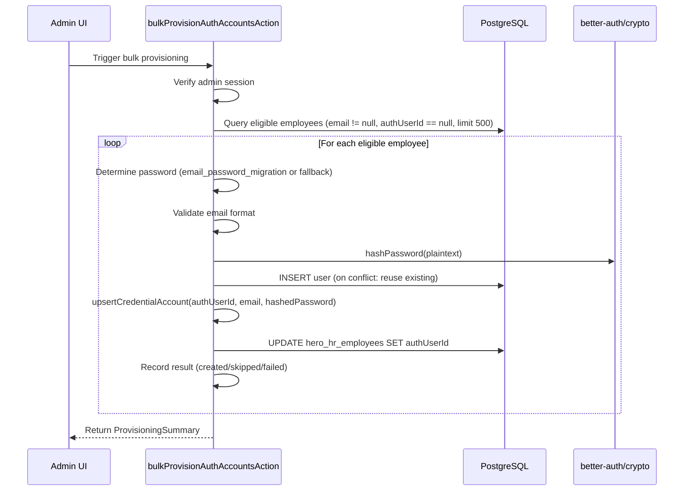

# Design Document: Bulk Auth Account Creation

## Overview

This feature provides a server action `bulkProvisionAuthAccountsAction` that creates Better Auth credential accounts in bulk for employees imported from DATA HERO Excel. It targets employees who have an email address but no linked auth account (`authUserId` is null), provisions a `user` + `account` (credential) record pair for each, and links them back via `authUserId`.

The action reuses the existing `upsertCredentialAccount` helper and `normalizeAuthEmail` utility already present in `admin-actions.ts`. No new database migrations are required — all writes target the existing `user`, `account`, and `hero_hr_employees` tables.

**Key design decisions:**

- Sequential processing with per-employee error isolation (no batch transaction)
- Reuse of `upsertCredentialAccount` for credential record creation/update
- Circuit breaker: halt after 10 consecutive failures
- Hard cap of 500 employees per invocation to bound execution time
- Non-transactional linking: auth records are not rolled back if the employee link update fails

## Architecture



## Components and Interfaces

### Server Action

```typescript
// app/dashboard/admin-actions.ts

export async function bulkProvisionAuthAccountsAction(): Promise<BulkProvisionResult> {
  // 1. Auth check (reuse existing session pattern)
  // 2. Query eligible employees
  // 3. Sequential processing loop
  // 4. Return summary
}
```

### Types

```typescript
interface BulkProvisionResult {
  success: boolean
  total: number
  created: number
  skipped: number
  failed: number
  failures: Array<{ employeeId: string; error: string }>
  interrupted: boolean
}
```

### Helper Functions (existing, reused)

| Function                                                      | Location               | Purpose                                      |
| ------------------------------------------------------------- | ---------------------- | -------------------------------------------- |
| `normalizeAuthEmail(email)`                                   | admin-actions.ts L2330 | `email.trim().toLowerCase()`                 |
| `upsertCredentialAccount({authUserId, email, password, now})` | admin-actions.ts L2334 | Creates or updates credential account record |
| `hashPassword(password)`                                      | `better-auth/crypto`   | Argon2/bcrypt hashing                        |
| `getCurrentActorEmail()`                                      | admin-actions.ts L12   | Gets current session user                    |

### New Internal Helpers

```typescript
function determinePassword(employee: {
  emailPasswordMigration: string | null
  employeeId: string
}): string {
  const migration = employee.emailPasswordMigration?.trim()
  if (migration && migration.length > 0) return migration
  return `Chitra#${employee.employeeId}`
}

function isValidEmailFormat(email: string): boolean {
  // local-part@domain where domain has at least one dot
  const parts = email.split('@')
  if (parts.length !== 2) return false
  const [local, domain] = parts
  return local.length > 0 && domain.length > 0 && domain.includes('.')
}
```

### Integration Point: Admin UI

A "Provision Auth Accounts" button in the User Management admin page triggers the action. The UI displays:

- Confirmation dialog before execution
- Progress/loading state during execution
- Summary toast/card showing created/skipped/failed counts on completion

No new page or route is needed — this integrates into the existing admin user management interface.

## Data Models

### Existing Tables Used (no migrations needed)

**`user` table** (Better Auth):
| Column | Type | Notes |
|--------|------|-------|
| id | text PK | UUID v4 generated by action |
| name | text | Employee fullName |
| email | text UNIQUE | Normalized (trim + lowercase) |
| emailVerified | boolean | Set to `true` |
| createdAt | timestamp | Current time on insert |
| updatedAt | timestamp | Current time on insert/update |

**`account` table** (Better Auth):
| Column | Type | Notes |
|--------|------|-------|
| id | text PK | UUID v4 |
| accountId | text | Normalized email |
| providerId | text | Always `"credential"` |
| userId | text FK→user.id | Links to auth user |
| password | text | Hashed password |
| createdAt | timestamp | On insert |
| updatedAt | timestamp | On insert/update |

**`hero_hr_employees` table** (updated field):
| Column | Type | Notes |
|--------|------|-------|
| authUserId | text FK→user.id | Set after successful provisioning |

### Eligibility Query

```sql
SELECT id, employee_id, full_name, email, email_password_migration
FROM hero_hr_employees
WHERE email IS NOT NULL
  AND TRIM(email) != ''
  AND auth_user_id IS NULL
ORDER BY id ASC
LIMIT 500
```

## Correctness Properties

_A property is a characteristic or behavior that should hold true across all valid executions of a system — essentially, a formal statement about what the system should do. Properties serve as the bridge between human-readable specifications and machine-verifiable correctness guarantees._

### Property 1: Eligibility filter correctness

_For any_ set of employee records, the eligibility filter SHALL return only those employees where `email` is non-null, non-empty (after trimming), and `authUserId` is null — and SHALL exclude all others.

**Validates: Requirements 1.1, 1.2, 1.3**

### Property 2: Password determination

_For any_ eligible employee, if `email_password_migration` contains at least one non-whitespace character after trimming, the determined password SHALL equal that trimmed value; otherwise, the determined password SHALL equal the concatenation of `"Chitra#"` and the employee's `employee_id`.

**Validates: Requirements 2.1, 2.2**

### Property 3: Password is always hashed

_For any_ successfully processed employee, the password stored in the credential account record SHALL NOT equal the plaintext password — it SHALL be the output of `hashPassword`.

**Validates: Requirements 2.3, 4.4**

### Property 4: Auth user record correctness

_For any_ eligible employee that is successfully processed, the created auth user record SHALL have: `name` equal to the employee's `fullName`, `email` equal to the normalized (trimmed, lowercased) employee email, `emailVerified` equal to `true`, a valid v4 UUID as `id`, and valid `createdAt`/`updatedAt` timestamps.

**Validates: Requirements 3.1, 3.2, 3.3**

### Property 5: Existing user reuse

_For any_ eligible employee whose normalized email matches an existing user record, the system SHALL reuse that existing user's `id` without modifying the existing record's `name`, `emailVerified`, or `createdAt` fields.

**Validates: Requirements 3.4**

### Property 6: Credential account upsert correctness

_For any_ eligible employee that is successfully processed, the credential account record SHALL have: `providerId` equal to `"credential"`, `accountId` equal to the normalized email, `userId` equal to the auth user's `id`, a valid UUID as `id`, and correct `createdAt`/`updatedAt` timestamps. If a matching credential already exists, it SHALL be updated rather than duplicated.

**Validates: Requirements 4.1, 4.2, 4.3, 4.5, 4.6**

### Property 7: Employee-AuthUser linkage

_For any_ eligible employee that is successfully processed (auth user created/found and credential account upserted), the employee's `authUserId` field SHALL be updated to equal the auth user's `id`.

**Validates: Requirements 5.1**

### Property 8: Summary count invariant

_For any_ execution of the bulk provisioner (whether complete or interrupted), the returned summary SHALL satisfy: `total == created + skipped + failed`.

**Validates: Requirements 6.5**

### Property 9: Error isolation

_For any_ batch of eligible employees where a single employee's provisioning fails (due to hash error, DB error, or validation), all other employees in the batch SHALL still be attempted (unless the circuit breaker threshold is reached).

**Validates: Requirements 7.1**

### Property 10: Email format validation

_For any_ string that does not match the pattern `local-part@domain` (where local-part has ≥1 character, domain has ≥1 character and contains at least one dot), the system SHALL skip that employee and record the rejection reason.

**Validates: Requirements 7.4**

## Error Handling

| Scenario                                | Behavior                                                          |
| --------------------------------------- | ----------------------------------------------------------------- |
| Employee has invalid email format       | Skip, record in failures array                                    |
| `hashPassword` throws                   | Skip employee, record failure, continue                           |
| User INSERT unique constraint violation | Retrieve existing user, continue                                  |
| Credential INSERT/UPDATE fails          | Skip employee, record failure, continue                           |
| Employee `authUserId` UPDATE fails      | Record failure, do NOT rollback auth records, continue            |
| Database connection lost                | Halt immediately, return partial summary with `interrupted: true` |
| 10 consecutive failures                 | Halt, return partial summary with `interrupted: true`             |
| Non-admin caller                        | Reject immediately, return `{ success: false }`                   |
| No eligible employees found             | Return summary with `total: 0`, `success: true`                   |

### Error Isolation Strategy

Each employee is processed independently — no shared transaction wraps the entire batch. This means:

- A failure on employee N does not affect employees 1..N-1 (already committed) or N+1..end (still pending)
- Auth records (user + account) created for an employee are NOT rolled back if the subsequent `authUserId` link update fails
- On re-run, the system will find the existing user (by email) and reuse it, making the operation safe to retry

### Circuit Breaker

A counter tracks consecutive failures. If it reaches 10, processing halts to prevent runaway errors (e.g., database overload). The counter resets to 0 on each success.

## Testing Strategy

### Unit Tests (example-based)

- Authorization rejection (no session, non-admin role)
- Empty eligible set returns zero-count summary
- Single employee happy path (created)
- Employee with existing user (reuse + update credential)
- Employee with invalid email format (skipped)
- Hash failure for one employee (skipped, others continue)
- Circuit breaker triggers at 10 consecutive failures
- 500 employee cap enforcement
- Audit log entry on successful trigger

### Property-Based Tests

**Library:** [fast-check](https://github.com/dubzzz/fast-check) (already available in JS/TS ecosystem)

**Configuration:** Minimum 100 iterations per property test.

Each property test references its design property:

| Test                   | Property    | Tag                                                                                      |
| ---------------------- | ----------- | ---------------------------------------------------------------------------------------- |
| Eligibility filter     | Property 1  | `Feature: bulk-auth-account-creation, Property 1: Eligibility filter correctness`        |
| Password determination | Property 2  | `Feature: bulk-auth-account-creation, Property 2: Password determination`                |
| Password hashing       | Property 3  | `Feature: bulk-auth-account-creation, Property 3: Password is always hashed`             |
| Auth user record       | Property 4  | `Feature: bulk-auth-account-creation, Property 4: Auth user record correctness`          |
| Existing user reuse    | Property 5  | `Feature: bulk-auth-account-creation, Property 5: Existing user reuse`                   |
| Credential upsert      | Property 6  | `Feature: bulk-auth-account-creation, Property 6: Credential account upsert correctness` |
| Employee linkage       | Property 7  | `Feature: bulk-auth-account-creation, Property 7: Employee-AuthUser linkage`             |
| Summary invariant      | Property 8  | `Feature: bulk-auth-account-creation, Property 8: Summary count invariant`               |
| Error isolation        | Property 9  | `Feature: bulk-auth-account-creation, Property 9: Error isolation`                       |
| Email validation       | Property 10 | `Feature: bulk-auth-account-creation, Property 10: Email format validation`              |

### Integration Tests

- Full end-to-end with real database: provision 5 employees, verify all tables updated
- Re-run idempotency: run twice, verify no duplicates created
- Mixed batch: some valid, some invalid emails, some with existing users

### Key Generators (for property tests)

- **Employee generator**: Random `employeeId`, `fullName`, `email` (valid/invalid), `emailPasswordMigration` (null/empty/whitespace/valid)
- **Email generator**: Mix of valid emails, whitespace-only strings, strings without `@`, strings without dot in domain
- **Password migration generator**: null | "" | " " | random non-empty string
