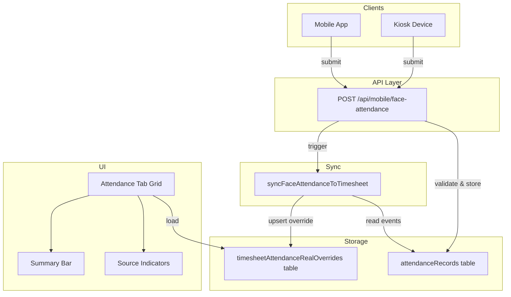

# Design Document: Face Attendance Timesheet Integration

## Overview

This feature connects face-based attendance (facial recognition check-in/check-out from mobile/kiosk) to the Scheduling Timesheet Attendance grid. The system already stores raw attendance events in `hero_attendance_records` and displays daily overrides via `hero_timesheet_attendance_real_overrides`. This design bridges the two by:

1. Adding a dedicated API endpoint for face attendance submissions with confidence scoring
2. Building a sync engine that aggregates raw events into daily clock-in/clock-out overrides
3. Implementing source-aware conflict resolution with hardcoded priority (attendance > excel > manual)
4. Enhancing the Attendance tab UI with source indicators and a summary bar

The design leverages existing infrastructure — the `attendanceRecords` table, the `timesheetAttendanceRealOverrides` table (which already has `source: 'attendance'`), and the `saveAttendanceRealOverridesAction` upsert pattern.

## Architecture



### Data Flow

1. **Submission**: Mobile/kiosk sends face attendance to `POST /api/mobile/face-attendance`
2. **Storage**: API validates input, stores in `attendanceRecords` with `eventType: 'checked-in' | 'checked-out'`
3. **Sync**: After storage, `syncFaceAttendanceToTimesheet` computes earliest check-in / latest check-out for that employee+day, upserts into `timesheetAttendanceRealOverrides` with `source: 'attendance'`
4. **Display**: Attendance tab loads overrides, applies conflict resolution (attendance > excel > manual), renders with source icons

### Key Design Decisions

| Decision                                               | Rationale                                                                                              |
| ------------------------------------------------------ | ------------------------------------------------------------------------------------------------------ |
| Reuse existing `source: 'attendance'` enum value       | No schema migration needed for the source column; 'attendance' already maps to device-based attendance |
| Add `confidenceScore` to `attendanceRecords` only      | The override table doesn't need confidence — it's metadata for the raw event                           |
| Sync inline after submission (not async job)           | Simplicity for MVP; single employee+day computation is fast (<50ms)                                    |
| Hardcoded priority (attendance > excel > manual)       | MVP simplicity; configurable priority deferred to future iteration                                     |
| Store `deviceType` in `attendanceRecords.locationNote` | Avoids schema migration; locationNote already stores contextual metadata                               |

## Components and Interfaces

### 1. Face Attendance API Endpoint

**Path**: `app/api/mobile/face-attendance/route.ts`

```typescript
// POST /api/mobile/face-attendance
interface FaceAttendanceRequest {
  employeeId: number
  siteId: number
  eventType: 'checked-in' | 'checked-out'
  photo: File // JPEG or PNG, max 5MB
  latitude: number // -90.0 to 90.0
  longitude: number // -180.0 to 180.0
  confidenceScore: number // 0.0 to 1.0
  deviceType: 'mobile' | 'kiosk'
  clientRequestId: string // max 255 chars, idempotency key
}

interface FaceAttendanceResponse {
  success: boolean
  record?: {
    id: number
    employeeId: number
    siteId: number
    eventType: string
    eventTime: string // ISO 8601
    photoUrl: string
    confidenceScore: number
    alreadyExisted?: boolean
  }
  error?: {
    code: string
    message: string
    field?: string
  }
}
```

**Authentication**: Bearer token or API key validated via `Authorization` header. Uses existing auth middleware pattern from other mobile API routes.

### 2. Sync Engine

**Path**: `lib/timesheet/face-attendance-sync.ts`

```typescript
interface SyncResult {
  employeeId: number
  siteId: number
  period: string // "YYYY-MM"
  day: number
  clockIn: string // "HH:mm" or ""
  clockOut: string // "HH:mm" or ""
  status: AttendanceCellStatus
  workMinutes: number | null
  validationFlags: string[]
}

/**
 * Reads all attendance records for a given employee+site+day,
 * computes earliest check-in / latest check-out,
 * upserts into timesheetAttendanceRealOverrides.
 */
function syncFaceAttendanceToTimesheet(
  employeeId: number,
  siteId: number,
  eventDate: Date
): Promise<SyncResult>
```

**Logic**:

1. Query `attendanceRecords` for the employee+site on the given date
2. Partition events into check-ins and check-outs based on `eventType`
3. Compute `clockIn` = earliest check-in event time (formatted HH:mm)
4. Compute `clockOut` = latest check-out event time (formatted HH:mm)
5. Compute `workMinutes` = difference in minutes (handle overnight: if clockOut < clockIn, add 24h)
6. Set `validationFlags`: `['missing-check-out']` if no check-out, `['missing-check-in']` if no check-in
7. Upsert into `timesheetAttendanceRealOverrides` with `source: 'attendance'`

### 3. Conflict Resolver

**Path**: `lib/timesheet/attendance-conflict-resolver.ts`

```typescript
type AttendanceSource = 'attendance' | 'excel' | 'manual'

// Hardcoded priority for MVP
const SOURCE_PRIORITY: Record<AttendanceSource, number> = {
  attendance: 3, // highest
  excel: 2,
  manual: 1, // lowest
}

interface ConflictResolution {
  winner: AttendanceSource
  hasConflict: boolean
  allSources: Array<{
    source: AttendanceSource
    clockIn: string
    clockOut: string
    updatedAt: Date
  }>
}

/**
 * Given multiple override records for the same employee+day,
 * returns the winning source based on priority.
 */
function resolveAttendanceConflict(
  overrides: Array<{
    source: AttendanceSource
    clockIn: string
    clockOut: string
    updatedAt: Date
  }>
): ConflictResolution
```

**Integration point**: The conflict resolver is called at data-load time in the Attendance tab. When the grid loads overrides, if multiple sources exist for the same cell (which shouldn't happen with the unique constraint, but can happen during import preview), the resolver picks the winner.

In practice, the sync engine uses `onConflictDoUpdate` — so only one record exists per employee+day. The conflict resolution logic applies when deciding whether to overwrite: the sync engine only writes if the incoming source has equal or higher priority than the existing source.

### 4. UI Components

**Path**: `components/timesheet/attendance-source-indicator.tsx`

```typescript
interface AttendanceSourceIndicatorProps {
  source: 'attendance' | 'excel' | 'manual'
  confidenceScore?: number // 0-1, only for 'attendance' source
  timestamp?: string // ISO 8601
}
```

**Path**: `components/timesheet/attendance-summary-bar.tsx`

```typescript
interface AttendanceSummaryBarProps {
  faceDays: number
  excelDays: number
  manualDays: number
  totalFilledDays: number
  facePercentage: number // 0-100, 1 decimal
}
```

## Data Models

### Schema Changes

#### 1. Add `confidenceScore` to `attendanceRecords`

```typescript
// db/schema/hero.ts — add to existing attendanceRecords table
export const attendanceRecords = pgTable('hero_attendance_records', {
  // ... existing fields ...
  confidenceScore: decimal('confidence_score', { precision: 4, scale: 3 }), // 0.000 to 1.000
  deviceType: text('device_type'), // 'mobile' | 'kiosk' | null (legacy records)
})
```

**Migration**: Add nullable columns `confidence_score` (decimal 4,3) and `device_type` (text) to `hero_attendance_records`.

#### 2. No changes to `timesheetAttendanceRealOverrides`

The existing table already has:

- `source` column with values `'manual' | 'excel' | 'attendance'` — `'attendance'` maps to face attendance
- `validationFlags` (jsonb) — can store `['missing-check-out']`, `['missing-check-in']`
- `workMinutes` (integer, nullable) — stores computed work duration
- Unique constraint on `(siteId, period, employeeId, day)` — ensures one override per cell

### Event Type Classification

Check-in events: `eventType` does NOT contain 'out', 'pulang', or 'checkout'
Check-out events: `eventType` contains 'out', 'pulang', or 'checkout'

```typescript
function isCheckOutEvent(eventType: string): boolean {
  const lower = eventType.toLowerCase()
  return lower.includes('out') || lower.includes('pulang') || lower.includes('checkout')
}
```

### Period Derivation

From an event timestamp, derive the period and day:

```typescript
function derivePeriodAndDay(eventTime: Date): { period: string; day: number } {
  const period = `${eventTime.getFullYear()}-${String(eventTime.getMonth() + 1).padStart(2, '0')}`
  const day = eventTime.getDate()
  return { period, day }
}
```

## Correctness Properties

_A property is a characteristic or behavior that should hold true across all valid executions of a system — essentially, a formal statement about what the system should do. Properties serve as the bridge between human-readable specifications and machine-verifiable correctness guarantees._

### Property 1: Storage Round-Trip

_For any_ valid face attendance submission (with valid employeeId, siteId, eventType, GPS coordinates, confidenceScore in [0,1], and clientRequestId), storing the record and reading it back SHALL produce a record with all original field values preserved (employeeId, siteId, eventType, eventTime, photoUrl, latitude, longitude, confidenceScore, clientRequestId).

**Validates: Requirements 1.1, 1.4**

### Property 2: Client Request ID Idempotency

_For any_ valid face attendance submission, submitting the same clientRequestId twice SHALL result in exactly one record in the database, and the second submission SHALL return the existing record without modification.

**Validates: Requirements 1.2, 1.3**

### Property 3: Invalid Input Rejection

_For any_ face attendance payload where at least one required field is missing or outside its valid range (employeeId not found, confidence outside [0,1], latitude outside [-90,90], longitude outside [-180,180], eventType not in allowed values), the validation function SHALL reject the payload and identify the invalid field.

**Validates: Requirements 1.5, 2.9**

### Property 4: Earliest Check-In Computation

_For any_ non-empty set of attendance events for the same employee on the same day where at least one event is a check-in (eventType does not contain 'out', 'pulang', or 'checkout'), the computed clockIn SHALL equal the minimum eventTime among all check-in events, formatted as HH:mm.

**Validates: Requirements 3.2, 6.2**

### Property 5: Latest Check-Out Computation

_For any_ non-empty set of attendance events for the same employee on the same day where at least one event is a check-out (eventType contains 'out', 'pulang', or 'checkout'), the computed clockOut SHALL equal the maximum eventTime among all check-out events, formatted as HH:mm.

**Validates: Requirements 3.3, 6.2**

### Property 6: Work Minutes Computation

_For any_ pair of clock-in time (HH:mm) and clock-out time (HH:mm), the computed workMinutes SHALL equal the positive difference in minutes. If clockOut < clockIn (overnight shift), workMinutes SHALL equal (clockOut + 1440) - clockIn.

**Validates: Requirements 6.4**

### Property 7: Conflict Resolution Priority

_For any_ set of attendance sources containing two or more distinct sources from {attendance, excel, manual}, the conflict resolver SHALL select the source with the highest priority (attendance > excel > manual) as the winner, regardless of timestamps or data completeness.

**Validates: Requirements 5.2, 5.4, 5.8**

### Property 8: Sync Recomputation Confluence

_For any_ set of attendance events for the same employee on the same day, the final computed override (clockIn, clockOut, workMinutes, validationFlags) SHALL be identical regardless of the order in which events were inserted or processed.

**Validates: Requirements 6.7**

### Property 9: Summary Source Distribution

_For any_ set of attendance override records for a site and period, the summary bar counts SHALL satisfy: faceDays + excelDays + manualDays = totalFilledDays, and facePercentage SHALL equal round((faceDays / totalFilledDays) × 100, 1) when totalFilledDays > 0, or 0.0 when totalFilledDays = 0.

**Validates: Requirements 7.1, 7.2, 7.4**

## Error Handling

### API Endpoint Errors

| Scenario                        | HTTP Status | Error Code           | Response                               |
| ------------------------------- | ----------- | -------------------- | -------------------------------------- |
| Missing/invalid required field  | 400         | `VALIDATION_ERROR`   | `{ field, message }`                   |
| No auth token                   | 401         | `UNAUTHORIZED`       | `{ message }`                          |
| Employee not found or inactive  | 404         | `EMPLOYEE_NOT_FOUND` | `{ message }`                          |
| Confidence below threshold      | 422         | `LOW_CONFIDENCE`     | `{ message, threshold, actual }`       |
| Photo too large or wrong format | 400         | `INVALID_PHOTO`      | `{ message, maxSize, allowedFormats }` |
| Duplicate clientRequestId       | 200         | —                    | `{ record, alreadyExisted: true }`     |
| Internal server error           | 500         | `INTERNAL_ERROR`     | `{ message }`                          |

### Sync Engine Errors

| Scenario                              | Handling                                       |
| ------------------------------------- | ---------------------------------------------- |
| No events found for employee+day      | No-op, return null                             |
| Employee not in override table's site | Skip sync, log warning                         |
| Database write failure                | Retry once, then log error and return failure  |
| Period is finalized (locked)          | Skip sync, log info — admin must reopen period |

### UI Error States

| Scenario                            | Display                                            |
| ----------------------------------- | -------------------------------------------------- |
| Failed to load overrides            | Toast error, show stale data if cached             |
| Summary computation with zero total | Show "0.0%" and all counts as 0                    |
| Missing confidence score in tooltip | Omit confidence line, show source + timestamp only |

## Testing Strategy

### Property-Based Tests (fast-check)

The project uses TypeScript with Vitest. Property-based tests will use **fast-check** library.

Each property test runs minimum **100 iterations** and is tagged with the design property reference.

| Property                    | Test File                                                 | What's Generated                           |
| --------------------------- | --------------------------------------------------------- | ------------------------------------------ |
| P1: Storage Round-Trip      | `__tests__/face-attendance-sync.property.test.ts`         | Random valid attendance payloads           |
| P2: Idempotency             | `__tests__/face-attendance-sync.property.test.ts`         | Random payloads with fixed clientRequestId |
| P3: Invalid Input Rejection | `__tests__/face-attendance-validation.property.test.ts`   | Random payloads with one+ invalid field    |
| P4: Earliest Check-In       | `__tests__/face-attendance-sync.property.test.ts`         | Random arrays of timestamps                |
| P5: Latest Check-Out        | `__tests__/face-attendance-sync.property.test.ts`         | Random arrays of timestamps                |
| P6: Work Minutes            | `__tests__/face-attendance-sync.property.test.ts`         | Random HH:mm time pairs                    |
| P7: Conflict Priority       | `__tests__/attendance-conflict-resolver.property.test.ts` | Random source combinations                 |
| P8: Confluence              | `__tests__/face-attendance-sync.property.test.ts`         | Random event sets, shuffled                |
| P9: Summary Distribution    | `__tests__/attendance-summary.property.test.ts`           | Random override record sets                |

**Tag format**: `// Feature: face-attendance-timesheet-integration, Property {N}: {title}`

### Unit Tests (Vitest)

| Area                 | Test File                                       | Cases                                             |
| -------------------- | ----------------------------------------------- | ------------------------------------------------- |
| `isCheckOutEvent`    | `__tests__/face-attendance-sync.test.ts`        | 'checked-out', 'pulang', 'checkout', 'checked-in' |
| `derivePeriodAndDay` | `__tests__/face-attendance-sync.test.ts`        | Various dates, month boundaries                   |
| `formatTimeHHMM`     | `__tests__/face-attendance-sync.test.ts`        | Midnight, noon, edge times                        |
| Validation function  | `__tests__/face-attendance-validation.test.ts`  | Each invalid field type                           |
| Source icon mapping  | `__tests__/attendance-source-indicator.test.ts` | Each source → correct icon                        |
| Tooltip content      | `__tests__/attendance-source-indicator.test.ts` | With/without confidence                           |

### Integration Tests

| Area                  | Test File                                           | What's Tested                            |
| --------------------- | --------------------------------------------------- | ---------------------------------------- |
| API endpoint E2E      | `__tests__/api/face-attendance.integration.test.ts` | Full request → DB → response cycle       |
| Sync after submission | `__tests__/api/face-attendance.integration.test.ts` | Submit → override record created         |
| Conflict on import    | `__tests__/api/face-attendance.integration.test.ts` | Face data exists, excel import attempted |

### Test Configuration

```typescript
// vitest.config.ts — property test settings
export default defineConfig({
  test: {
    // fast-check runs 100 iterations by default
    // Override per-test with fc.assert(property, { numRuns: 200 }) if needed
  },
})
```
