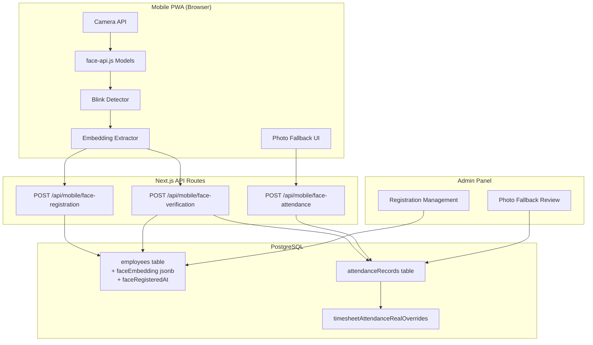

# Design Document: Face Recognition Attendance

## Overview

Face Recognition Attendance is a biometric attendance system for the HERO mobile PWA. It uses a **register-once, verify-every-time** approach: employees register their face once (extracting a 128-dimensional embedding), then verify identity daily via real-time face comparison for check-in/check-out.

**Key architectural decisions:**

- **Client-side**: face-api.js (TensorFlow.js) handles face detection, landmark extraction, and embedding generation in the browser
- **Server-side**: Cosine similarity comparison of 128-dim float embeddings stored in PostgreSQL
- **Anti-spoofing**: Client-side blink detection using Eye Aspect Ratio (EAR) from 68-point face landmarks
- **Fallback**: Manual photo capture when face recognition fails, flagged for admin review
- **Integration**: Successful verification creates attendance records and syncs to existing timesheet system

## Architecture



### Data Flow

1. **Registration**: Camera → face-api.js detection → blink check → extract embedding → POST to server → store in `employees.faceEmbedding`
2. **Verification**: Camera → face-api.js detection → blink check → extract embedding → POST to server → cosine similarity comparison → if match: create attendance record → sync to timesheet
3. **Fallback**: 3 failed verifications (or no face/low quality) → manual photo capture → POST to server → create attendance record with `source: photo-fallback` + `needs-review` flag

## Components and Interfaces

### Client-Side Components

#### FaceModelLoader

Responsible for downloading and caching face-api.js models.

```typescript
interface FaceModelLoader {
  loadModels(): Promise<void>
  isLoaded(): boolean
  getLoadProgress(): number // 0-100
}
```

Models required (~6MB total):

- `ssd_mobilenetv1` — face detection
- `face_landmark_68_model` — 68-point landmark detection
- `face_recognition_model` — 128-dim embedding extraction

Caching strategy: Cache API with versioned keys. Check cache first, download from `/models/` path on app server if missing.

#### BlinkDetector

Anti-spoofing via Eye Aspect Ratio monitoring.

```typescript
interface BlinkDetector {
  start(landmarks$: Observable<FaceLandmarks68>): void
  stop(): void
  onBlinkDetected: () => void
  isLivenessConfirmed(): boolean
}

// EAR formula: (|p2-p6| + |p3-p5|) / (2 * |p1-p4|)
// Blink = EAR drops below 0.2, returns above 0.2 within 400ms
```

#### FaceCapture

Orchestrates camera, detection, blink check, and embedding extraction.

```typescript
interface FaceCaptureResult {
  embedding: number[] // 128-dim float array
  livenessConfirmed: boolean
}

interface FaceCapture {
  startCapture(mode: 'registration' | 'verification'): Promise<FaceCaptureResult>
  stopCapture(): void
}
```

#### PhotoFallback

Manual photo capture when face recognition fails.

```typescript
interface PhotoFallbackResult {
  photo: Blob // JPEG or PNG, max 5MB
  capturedAt: Date
}
```

### Server-Side Components

#### Face Registration API (`/api/mobile/face-registration`)

```typescript
// Request
interface FaceRegistrationRequest {
  employeeId: number
  embedding: number[] // exactly 128 finite floats
}

// Response (201)
interface FaceRegistrationResponse {
  success: true
  registeredAt: string // ISO timestamp
}
```

Already implemented. Stores embedding in `employees.faceEmbedding` (jsonb column), sets `employees.faceRegisteredAt`.

#### Face Verification API (`/api/mobile/face-verification`)

```typescript
// Request
interface FaceVerificationRequest {
  employeeId: number
  embedding: number[] // 128 finite floats (live capture)
  siteId: number
  eventType: 'checked-in' | 'checked-out'
  latitude: number
  longitude: number
  clientRequestId: string
}

// Response (200) — verified
interface FaceVerificationSuccess {
  verified: true
  similarityScore: number
  attendanceRecord: {
    id: number
    eventType: string
    eventTime: string
  }
}

// Response (200) — not verified
interface FaceVerificationFailure {
  verified: false
  similarityScore: number
}
```

Already implemented. Computes cosine similarity, threshold at 0.6. On success: creates attendance record, syncs to timesheet.

#### Face Attendance (Photo Fallback) API (`/api/mobile/face-attendance`)

Already implemented. Accepts FormData with photo, creates attendance record with `locationNote: deviceType`. For photo-fallback, the `status` field will be set to `needs-review` and `locationNote` to `photo-fallback`.

#### Cosine Similarity (`lib/face-recognition/cosine-similarity.ts`)

```typescript
function cosineSimilarity(a: number[], b: number[]): number
// Returns dot(a,b) / (|a| * |b|), range [-1, 1]
// Returns 0 for zero-magnitude vectors
```

Already implemented.

#### Embedding Validator (`lib/face-recognition/embedding-validator.ts`)

```typescript
function validateEmbedding(input: unknown): { valid: boolean; error?: string }
// Validates: is array, length === 128, all elements are finite numbers
```

Already implemented.

### Admin Components

#### FaceRegistrationManagement

Server action + UI component for viewing/managing face registrations.

```typescript
// Server action
async function getFaceRegistrationStatus(): Promise<{
  employees: Array<{
    id: number
    name: string
    isRegistered: boolean
    registeredAt: string | null
  }>
  stats: { registered: number; unregistered: number }
}>

async function deleteFaceEmbedding(employeeId: number): Promise<void>
```

#### PhotoFallbackReview

Server action + UI component for reviewing photo-fallback records.

```typescript
// Server action
async function getPhotoFallbackRecords(filter?: 'pending' | 'approved' | 'rejected'): Promise<
  Array<{
    id: number
    employeeName: string
    eventType: string
    eventTime: string
    siteId: number
    photoUrl: string
    status: string
  }>
>

async function reviewFallbackRecord(
  recordId: number,
  action: 'approve' | 'reject',
  reason?: string
): Promise<void>
```

## Data Models

### Existing Tables (Already in Schema)

#### `employees` table — extended columns

```sql
face_embedding    JSONB         -- 128-dim float array, nullable
face_registered_at TIMESTAMP   -- registration timestamp, nullable
```

Already added to `db/schema/hero.ts`.

#### `attendanceRecords` table

```sql
id                SERIAL PRIMARY KEY
employee_id       INTEGER NOT NULL REFERENCES employees(id)
site_id           INTEGER NOT NULL REFERENCES sites(id)
event_type        TEXT NOT NULL        -- 'checked-in' | 'checked-out'
event_time        TIMESTAMP NOT NULL
status            TEXT NOT NULL        -- 'verified' | 'needs-review' | 'rejected'
location_note     TEXT NOT NULL        -- 'face-recognition' | 'photo-fallback' | device type
photo_url         TEXT                 -- photo path for fallback records
latitude          TEXT
longitude         TEXT
confidence_score  DECIMAL(4,3)        -- cosine similarity score
device_type       TEXT                 -- 'mobile' | 'kiosk'
client_request_id TEXT UNIQUE          -- idempotency key
```

Already exists. The `location_note` field doubles as the attendance source indicator:

- `'face-recognition'` — verified via face embedding match
- `'photo-fallback'` — manual photo capture, needs admin review

### Source Differentiation

| Source                    | `status`       | `location_note`    | `confidence_score`          |
| ------------------------- | -------------- | ------------------ | --------------------------- |
| Face recognition          | `verified`     | `face-recognition` | 0.6–1.0 (cosine similarity) |
| Photo fallback            | `needs-review` | `photo-fallback`   | null                        |
| Photo fallback (approved) | `verified`     | `photo-fallback`   | null                        |
| Photo fallback (rejected) | `rejected`     | `photo-fallback`   | null                        |

### Timesheet Integration

On attendance record creation, `syncFaceAttendanceToTimesheet` upserts into `timesheetAttendanceRealOverrides`:

- Partitions records into check-ins/check-outs for the day
- Computes earliest check-in, latest check-out
- Calculates work minutes
- Sets validation flags (missing-check-in, missing-check-out)

## Correctness Properties

_A property is a characteristic or behavior that should hold true across all valid executions of a system — essentially, a formal statement about what the system should do. Properties serve as the bridge between human-readable specifications and machine-verifiable correctness guarantees._

### Property 1: Registration Round-Trip

_For any_ valid 128-dimensional float array embedding and any active employee, storing the embedding via the registration API and then retrieving it from the database should produce an array identical to the original embedding.

**Validates: Requirements 2.7, 7.3, 11.1**

### Property 2: Registration Idempotence (Single Embedding Per Employee)

_For any_ employee and any sequence of registration requests, the employee should have exactly one stored embedding at any time — the most recently registered one. Re-registering overwrites the previous embedding entirely.

**Validates: Requirements 2.8, 7.6, 11.2, 11.3**

### Property 3: Blink Detection from EAR Sequences

_For any_ sequence of Eye Aspect Ratio values over time, a blink is detected if and only if the EAR drops below 0.2 and returns above 0.2 within 400ms. No other pattern should trigger a blink detection.

**Validates: Requirements 3.1, 3.3**

### Property 4: Cosine Similarity Mathematical Properties

_For any_ two 128-dimensional non-zero vectors `a` and `b`:

- `cosineSimilarity(a, a)` equals 1.0 (self-similarity)
- `cosineSimilarity(a, b)` is in the range [-1, 1]
- `cosineSimilarity(a, b)` equals `cosineSimilarity(b, a)` (symmetry)

**Validates: Requirements 4.4, 8.3**

### Property 5: Verification Threshold Determines Outcome

_For any_ employee with a stored embedding and any live embedding, the verification API returns `verified: true` if and only if the cosine similarity between the live and stored embeddings exceeds 0.6. Otherwise it returns `verified: false`.

**Validates: Requirements 4.5, 4.6, 8.4, 8.5**

### Property 6: Attendance Record Field Completeness

_For any_ successful face verification, the created attendance record must contain all required fields: employeeId, siteId, eventType (checked-in or checked-out), eventTime, status ("verified"), locationNote ("face-recognition"), confidenceScore (the similarity score), deviceType ("mobile"), latitude, longitude, and a unique clientRequestId.

**Validates: Requirements 5.1, 12.1, 12.3**

### Property 7: Idempotent Submission via clientRequestId

_For any_ clientRequestId, submitting the same verification request multiple times should never create duplicate attendance records. The second and subsequent submissions should return the existing record.

**Validates: Requirements 5.4, 12.4**

### Property 8: Photo-Fallback Records Always Flagged for Review

_For any_ attendance record created via the photo-fallback mechanism, the record must have status "needs-review" and locationNote "photo-fallback".

**Validates: Requirements 6.6**

### Property 9: Embedding Validation

_For any_ input value, the embedding validator returns `valid: true` if and only if the input is an array of exactly 128 elements where every element is a finite floating-point number. All other inputs are rejected.

**Validates: Requirements 7.2, 8.7**

### Property 10: Admin Review Action Updates Record Correctly

_For any_ photo-fallback attendance record:

- Approving it sets status to "verified" and removes the needs-review state
- Rejecting it sets status to "rejected" and stores the provided rejection reason

**Validates: Requirements 10.4, 10.5**

## Error Handling

### Client-Side Errors

| Error                     | Handling                                              |
| ------------------------- | ----------------------------------------------------- |
| Camera permission denied  | Show permission request dialog with instructions      |
| No face detected (10s)    | Show guidance message, offer retry                    |
| Multiple faces detected   | Show "only one face" warning                          |
| Model download failure    | Show error + retry button                             |
| Blink not detected (5s)   | Show "please blink naturally" message, restart window |
| Network error on API call | Show offline message, allow retry                     |

### Server-Side Errors

| Error                       | HTTP Status | Code                              |
| --------------------------- | ----------- | --------------------------------- |
| Missing/invalid auth token  | 401         | `UNAUTHORIZED`                    |
| Missing required fields     | 400         | `VALIDATION_ERROR`                |
| Invalid embedding format    | 400         | `INVALID_EMBEDDING`               |
| Employee not found/inactive | 404         | `EMPLOYEE_NOT_FOUND`              |
| No face registration        | 404         | `NO_FACE_REGISTRATION`            |
| Timesheet sync failure      | —           | Logged, attendance still succeeds |
| Internal server error       | 500         | `INTERNAL_ERROR`                  |

### Fallback Triggers

| Condition                           | Trigger                          |
| ----------------------------------- | -------------------------------- |
| 3 consecutive verification failures | Offer photo fallback             |
| No face detected for 15s            | Offer photo fallback immediately |
| Face confidence < 0.3               | Offer photo fallback immediately |

## Testing Strategy

### Property-Based Tests (fast-check)

Library: **fast-check** (TypeScript PBT library)
Configuration: Minimum 100 iterations per property test.

Each property test references its design property:

```typescript
// Feature: face-recognition-attendance, Property 1: Registration round-trip
// Feature: face-recognition-attendance, Property 4: Cosine similarity mathematical properties
// Feature: face-recognition-attendance, Property 9: Embedding validation
```

**Target functions for PBT:**

- `cosineSimilarity(a, b)` — Properties 4, 5
- `validateEmbedding(input)` — Property 9
- `detectBlink(earSequence)` — Property 3
- Registration store/retrieve — Properties 1, 2
- Verification threshold logic — Property 5
- Idempotency logic — Property 7

### Unit Tests (Vitest)

- Specific examples for each API endpoint (happy path + error cases)
- Edge cases: zero vectors, NaN values, boundary similarity scores (0.599, 0.600, 0.601)
- Auth validation (missing token, invalid token)
- Employee not found / inactive scenarios
- Photo fallback trigger conditions

### Integration Tests

- Full registration → verification → attendance record → timesheet sync flow
- Photo fallback → needs-review → admin approve/reject flow
- Idempotency: duplicate clientRequestId handling
- Timesheet sync failure doesn't block attendance creation

### E2E Tests (if applicable)

- Camera permission flow (manual/visual testing)
- Face detection + blink detection UX flow
- Photo fallback UX after 3 failures
