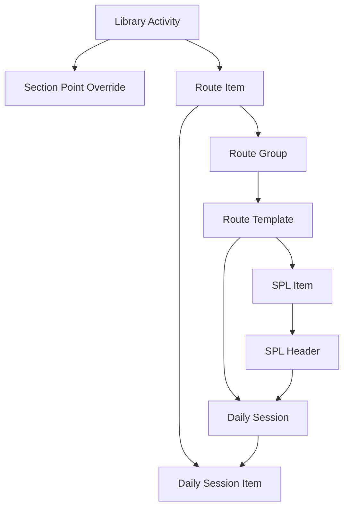

# Daily Activity Routing Blueprint

Status snapshot: 21 April 2026

## 1. Tujuan

Blueprint ini menjadi fondasi baru untuk Daily Activity System HERO agar:

- bisa menampung banyak section
- bisa beda route per jabatan
- tetap simpel di mobile
- poin default tetap terkontrol
- Section Head bisa override tanpa merusak master global
- `assignment` lama bisa digeser menjadi `Surat Perintah Lembur (SPL)`

Model target:

`Library Master -> Route Builder -> SPL -> Daily Execution`

## 2. Domain Model

### 2.1 Library Master

Tetap menjadi sumber default pekerjaan.

Tabel:

- `hero_activity_libraries`
- `hero_activity_section_point_overrides`

Fungsi:

- simpan master pekerjaan global
- simpan default point
- simpan default requirement: unit, waktu, remark, photo
- simpan override label/point per section/jabatan/site

### 2.2 Route Builder

Menjadi sumber nested list harian.

Tabel:

- `hero_activity_route_templates`
- `hero_activity_route_groups`
- `hero_activity_route_items`

Fungsi:

- membagi pekerjaan per `Section + Jabatan + Shift`
- membagi nested list ke group operasional
- menyimpan item default dan point override per route

### 2.3 SPL

Pengganti bisnis dari assignment lama.

Tabel:

- `hero_overtime_command_letters`
- `hero_overtime_command_letter_items`

Fungsi:

- menyimpan surat perintah lembur resmi
- menyimpan line pekerjaan planned
- bisa import dari route template
- tetap bisa menambah pekerjaan custom
- siap dijembatani ke approval engine existing

### 2.4 Daily Execution

Mencatat realisasi aktual.

Tabel:

- `hero_daily_activity_sessions`
- `hero_daily_activity_session_items`

Fungsi:

- simpan satu sesi kerja harian per user
- simpan checklist aktual per item
- snapshot rule supaya histori lama tidak berubah jika library direvisi
- simpan actual point, unit, waktu, remark, dan evidence

## 3. Detail Tabel

### 3.1 `hero_activity_route_templates`

Satu template route untuk kombinasi section, jabatan, site, dan shift.

Field penting:

- `site_id`
- `department_id`
- `section_id`
- `position_id`
- `route_code`
- `route_name`
- `shift_code`
- `mobile_enabled`
- `approval_required`
- `version_label`
- `effective_from`
- `effective_to`
- `is_active`

### 3.2 `hero_activity_route_groups`

Group nested untuk route.

Contoh:

- Safety Talk
- Inspection
- Repair
- Housekeeping

Field penting:

- `route_template_id`
- `group_key`
- `group_name`
- `sort_order`
- `is_required`

### 3.3 `hero_activity_route_items`

Unit item yang akan dicentang user.

Field penting:

- `route_group_id`
- `library_activity_id`
- `item_code`
- `item_label`
- `item_description`
- `point_override`
- `requires_unit`
- `requires_time`
- `requires_remark`
- `requires_photo`
- `is_optional`
- `allow_custom_unit`
- `sort_order`

### 3.4 `hero_activity_section_point_overrides`

Override default point/label tanpa mengubah master global.

Field penting:

- `site_id`
- `department_id`
- `section_id`
- `position_id`
- `library_activity_id`
- `override_label`
- `override_points`
- `reason`
- `is_active`

### 3.5 `hero_overtime_command_letters`

Header SPL.

Field penting:

- `request_submission_id`
- `site_id`
- `department_id`
- `section_id`
- `position_id`
- `requested_by_employee_id`
- `approved_by_employee_id`
- `spl_number`
- `title`
- `work_date`
- `planned_start_at`
- `planned_end_at`
- `status`
- `request_notes`
- `execution_notes`

### 3.6 `hero_overtime_command_letter_items`

Line pekerjaan dalam SPL.

Field penting:

- `overtime_command_letter_id`
- `route_template_id`
- `route_item_id`
- `library_activity_id`
- `line_label`
- `line_description`
- `target_unit`
- `estimated_minutes`
- `planned_points`
- `sort_order`
- `is_custom_line`

### 3.7 `hero_daily_activity_sessions`

Header eksekusi harian.

Field penting:

- `site_id`
- `employee_id`
- `department_id`
- `section_id`
- `position_id`
- `route_template_id`
- `overtime_command_letter_id`
- `legacy_assignment_id`
- `session_code`
- `shift_code`
- `work_date`
- `status`
- `submission_source`
- `started_at`
- `submitted_at`
- `approved_at`
- `summary_remark`

### 3.8 `hero_daily_activity_session_items`

Checklist aktual.

Field penting:

- `session_id`
- `route_item_id`
- `library_activity_id`
- `overtime_command_letter_item_id`
- `snapshot_label`
- `snapshot_group_name`
- `snapshot_payload`
- `started_at`
- `ended_at`
- `checked_at`
- `unit_number`
- `remark`
- `actual_points`
- `is_checked`
- `is_custom_item`
- `photo_count`
- `sort_order`

## 4. Rule Poin

Urutan kalkulasi yang direkomendasikan:

`actual_point = route_item.point_override ?? section_override.override_points ?? library.base_points`

Catatan:

- histori wajib snapshot saat submit
- perubahan library setelahnya tidak boleh mengubah data lama

## 5. Relasi Inti

## 6. Wireframe Flow

### 6.1 Desktop Library

Layout:

- kiri: rail filter site / department / section / jabatan
- tengah: tree `Section > Jabatan > Group > Item`
- kanan: inspector detail default point, override, requirement

Command bar:

- search
- filter
- action menu
- Excel export

### 6.2 Desktop Route Builder

Layout:

- header template
- canvas nested group
- panel rule item

Flow:

1. pilih section
2. pilih jabatan
3. buat group
4. tambah item dari library
5. override point / rule bila perlu
6. publish version

### 6.3 Desktop SPL

Layout:

- header SPL
- daftar line pekerjaan
- approval strip

Flow:

1. atasan pilih section/jabatan/tanggal
2. import route atau tambah custom line
3. isi target unit dan estimasi
4. submit ke approval engine
5. worker menerima context SPL di mobile

### 6.4 Mobile Daily Checklist

Flow:

1. user lookup / auto-detect section
2. jika multi-role, pilih jabatan
3. sistem load route hari ini
4. tiap group tampil accordion
5. user centang item
6. field detail muncul hanya jika wajib
7. submit session

Prinsip mobile:

- jangan squeeze desktop table
- fokus satu pekerjaan utama per screen
- unchecked item tetap ringkas
- checked item baru expand

## 7. Rollout

### Phase 1

- tambahkan tabel v2 secara additive
- jangan matikan `activityLibraries` dan `jobAssignments` lama dulu

### Phase 2

- buka workspace blueprint / route review di dashboard

### Phase 3

- ganti mobile input dari form flat ke checklist route

### Phase 4

- ganti experience `assignment` menjadi `SPL`
- bridge ke approval engine + request center

### Phase 5

- pindahkan analytics dan export ke sumber session v2

## 8. Keputusan Arsitektur

Final direction:

- `Section` menjadi pintu masuk utama
- `Jabatan` menjadi variasi route
- `Library` tetap global
- `Override` dikelola lokal oleh Section Head
- `SPL` menjadi plan lembur resmi
- `Daily Session` menjadi realisasi aktual
- `Session Item` menyimpan snapshot untuk audit dan histori
